Readme 
---

# Bird Applications

The Bird Application consists of two APIs: the bird API and the birdImage API. This guide covers installation, Dockerization, security considerations, infrastructure setup, Kubernetes installation, and observability. Follow the instructions to get the application up and running.

## Installation & Running Locally

### 1. Bird API

```bash
cd Bird
make bird
./getBird
```

### 2. BirdImage API

```bash
cd birdImage
make birdImage
./getBirdImage
```

## Dockerization

### Dockerfiles

Dockerfiles are located in their respective directories:
- `bird/`
- `birdImage/`

### Security Considerations

- **Running as a Non-Root User**:
  - Added a non-root user `appuser` and group `appgroup`.
  - Changed ownership of the binary to `appuser:appgroup`.
  - Configured the container to run as `appuser` using the `USER` instruction.

- **Minimal Base Image**:
  - Used Alpine for a minimal final image to reduce the attack surface.

- **Build and Deploy**:
  - Done via GitHub Actions.
  - Secrets are stored as GitHub Action secrets.
  - Built images are pushed to a private Docker registry.

## Infrastructure on AWS

### Setup

- Created VPC, Security Groups (SG), and EC2 instances using IaC.
- Deployed master and worker nodes in a private subnet for security.
  - **Note**: Restrict access to the bastion host to your IP address (default is "0.0.0.0/0" in code for personal security reasons, can't push my public ip to github, replace with your public ip when testing :) ).

- Deployed an Application Load Balancer (ALB) to expose the Bird API service.
- Deployed a bastion host to manage access to master and worker nodes and deploy new changes.

### Infrastructure as Code (IaC) - AWS Setup

To create the infrastructure (VPC, Security Groups, EC2 instances, LB and other AWS resource that were required) using Terraform, follow these steps:

1. **Navigate to the directory containing the Terraform configuration files**:

   ```bash
   cd path/to/terraform/files
   ```

2. **Run the following Terraform commands**:

   - Initialize Terraform:

     ```bash
     terraform init
     ```

   - Generate and review the execution plan:

     ```bash
     terraform plan
     ```

   - Apply the changes to create the infrastructure:

     ```bash
     terraform apply
     ```

   These steps will provision the VPC, security groups, EC2 instances, and other AWS resources as defined in your Terraform configuration.
   N.B: Terraform state file is stored in remote backend in s3 Buckets

## Successful Terraform apply
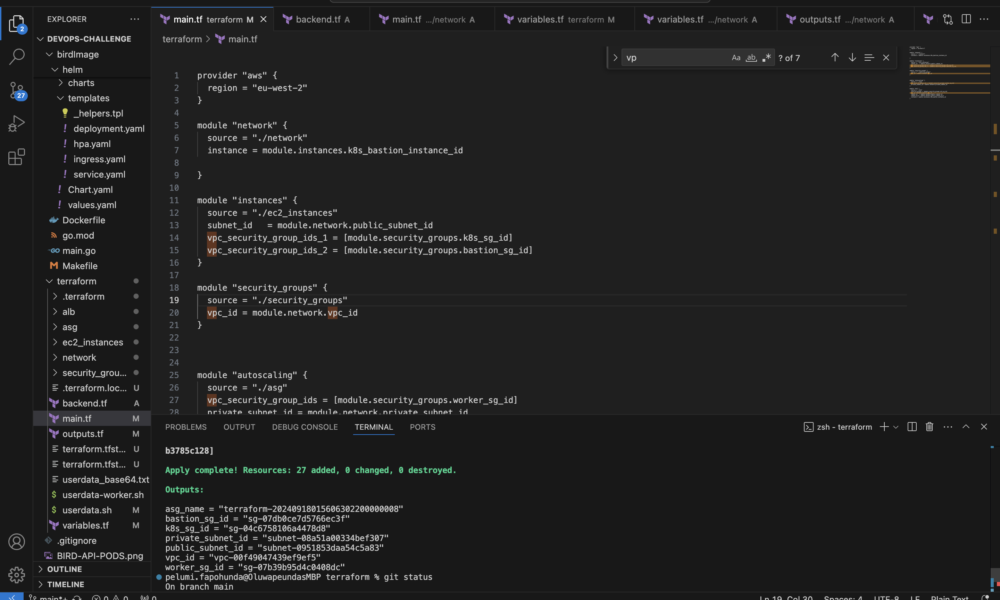

---

## Recent Changes

### Code Update
I made a change in the code to update the HTTP request URL to communicate with birdImage service. The new code snippet is:
```go
res, err := http.Get(fmt.Sprintf("http://birdimage-api-birdimage-service:4200?birdName=%s"))
```

### Userdata for Installation
We have used userdata scripts for installation and configuration of our master and worker nodes. The userdata scripts include:
- **Master Node**: Configures the Kubernetes master node.
- **Worker Nodes**: Automates the installation and joining of worker nodes to the Kubernetes cluster.

To run the IaC, use the following Terraform commands:
```sh
terraform init
terraform plan
terraform apply
```

---


---


### Security Groups

- Ensured communication between worker and master nodes.
- Restricted external access to only certain ports from bastion hosts (22 for ssh and 6443(kube api) for deployment).

## Kubernetes Installation

### Why Kubeadm over K3s
- I used Kubeadm instead of K3s because it provides production grade environment over lighter weight k3s (even though k3s is smaller and quicker to install)

### Setup

- Installed Kubernetes using Kubeadm on EC2 instances.
- Created an AMI of bootstrapped instances.

### Master Node Configuration

1. **Disable Swap**:
    ```bash
    sudo swapoff -a
    sudo sed -i '/ swap / s/^/#/' /etc/fstab
    ```

2. **Set Hostnames**:
    ```bash
    sudo hostnamectl set-hostname "master-node"
    exec bash
    ```

3. **Update `/etc/hosts`**:
    ```bash
    sudo nano /etc/hosts
    10.0.0.4 master-node
    10.0.0.5 worker-node1
    # Save and exit (Ctrl + X)
    ```

4. **Set Up IPV4 Bridge**:
    ```bash
    cat <<EOF | sudo tee /etc/modules-load.d/k8s.conf
    overlay
    br_netfilter
    EOF

    sudo modprobe overlay
    sudo modprobe br_netfilter

    cat <<EOF | sudo tee /etc/sysctl.d/k8s.conf
    net.bridge.bridge-nf-call-iptables = 1
    net.bridge.bridge-nf-call-ip6tables = 1
    net.ipv4.ip_forward = 1
    EOF

    sudo sysctl --system
    ```

5. **Install Kubernetes Components**:
    ```bash
    sudo apt-get update
    sudo apt-get install -y apt-transport-https ca-certificates curl
    sudo mkdir /etc/apt/keyrings
    curl -fsSL https://pkgs.k8s.io/core:/stable:/v1.30/deb/Release.key | sudo gpg --dearmor -o /etc/apt/keyrings/kubernetes-apt-keyring.gpg
    echo 'deb [signed-by=/etc/apt/keyrings/kubernetes-apt-keyring.gpg] https://pkgs.k8s.io/core:/stable:/v1.30/deb/ /' | sudo tee /etc/apt/sources.list.d/kubernetes.list
    sudo apt update
    sudo apt install kubeadm kubelet kubectl
    sudo apt-mark hold kubeadm kubelet kubectl
    ```

6. **Install Docker**:
    ```bash
    sudo apt update
    sudo apt install docker.io -y
    sudo systemctl enable docker
    sudo systemctl status docker
    # Start Docker if necessary
    sudo systemctl start docker
    ```

7. **Configure Containerd**:
    ```bash
    sudo mkdir /etc/containerd
    sudo sh -c "containerd config default > /etc/containerd/config.toml"
    sudo sed -i 's/SystemdCgroup = false/SystemdCgroup = true/' /etc/containerd/config.toml
    sudo systemctl restart containerd.service
    sudo systemctl restart kubelet.service
    sudo systemctl enable kubelet.service
    ```

8. **Initialize Kubernetes Cluster**:
    ```bash
    sudo kubeadm config images pull
    sudo kubeadm init --pod-network-cidr=10.10.0.0/16
    mkdir -p $HOME/.kube
    sudo cp -i /etc/kubernetes/admin.conf $HOME/.kube/config
    sudo chown $(id -u):$(id -g) $HOME/.kube/config
    ```

9. **Configure Calico**:
    ```bash
    kubectl create -f https://raw.githubusercontent.com/projectcalico/calico/v3.26.1/manifests/tigera-operator.yaml
    curl https://raw.githubusercontent.com/projectcalico/calico/v3.26.1/manifests/custom-resources.yaml -O
    sed -i 's/cidr: 192\.168\.0\.0\/16/cidr: 10.10.0.0\/16/g' custom-resources.yaml
    kubectl create -f custom-resources.yaml
    ```

### Worker Nodes

- Follow steps 1, 3, 4, 5, and 6 from the Master Node setup.
- Add worker nodes to the cluster:
    ```bash
    sudo kubeadm join <MASTER_NODE_IP>:<API_SERVER_PORT> --token <TOKEN> --discovery-token-ca-cert-hash <CERTIFICATE_HASH>
    ```

- **DNS Resolution**:
    ```bash
    sudo nano /etc/resolv.conf
    # Replace nameserver with:
    nameserver 8.8.8.8
    nameserver 8.8.4.4
    # Restart CoreDNS
    kubectl rollout restart deployment coredns -n kube-system
    ```

## Kubernetes Manifests

- Manifests for deploying the APIs are located in:
  - `bird/helm/`
  - `birdImage/helm/`

## Bonus Points: Observability, Helm, Scaling

- **Autoscaling**:
  - Implemented HPA for pods (check Helm templates) and ASG for EC2 instances.

- **Helm**:
  - Used Helm for templating the application.
  - Helm directories are located in `bird/helm/` and `birdImage/helm/`.

- **Observability**:
  - Installed Prometheus and Grafana using Helm:
    ```bash
    helm repo add prometheus-community https://prometheus-community.github.io/helm-charts
    helm repo add grafana https://grafana.github.io/helm-charts
    helm repo update
    kubectl get secret --namespace default grafana -o jsonpath="{.data.admin-password}" | base64 --decode ; echo
    ```
## Running Bird Image Api
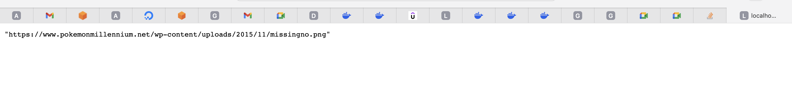   

## Running Bird Api
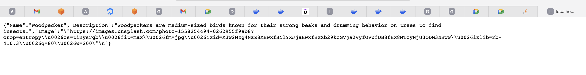 

## Bird Image Produced
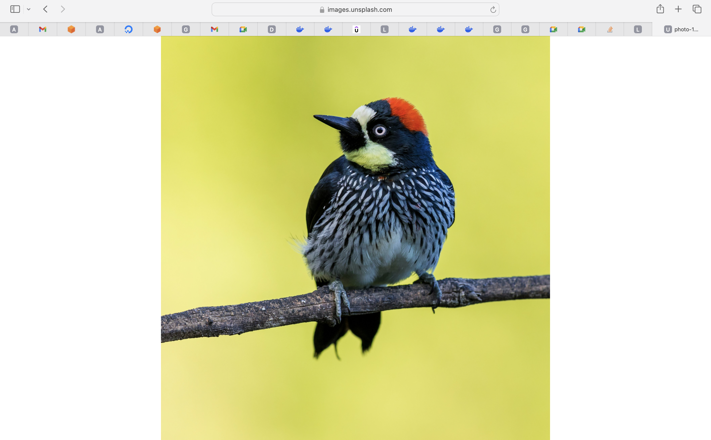 

## Running Bird Api Pods in the cluster
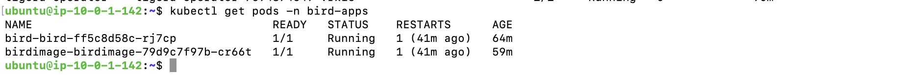

## Running Bird Api Services in the cluster
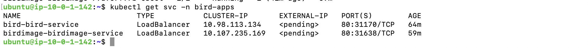

## Running Kubernetes Nodes in the cluster
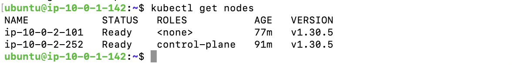

## Running Kubernetes Pods in the cluster
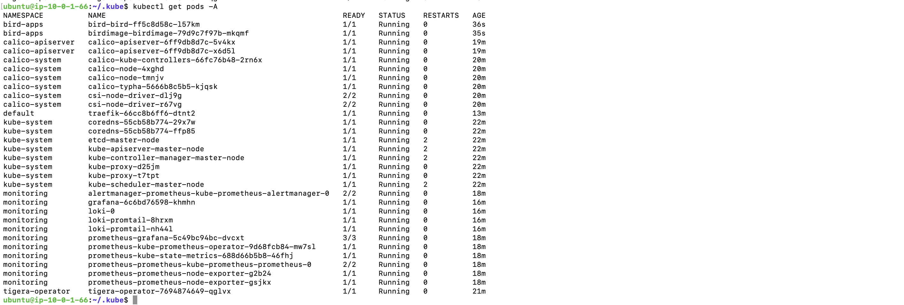

## Running Kubernetes Services in the cluster
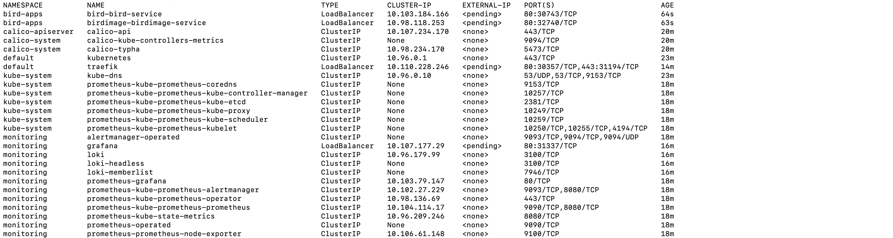

## Successful CI/CD
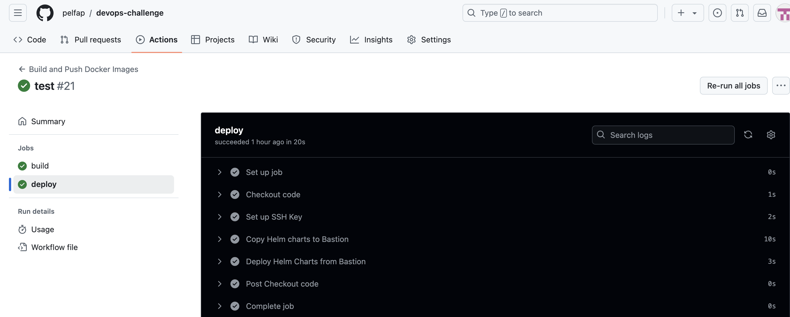

## Loki Metrics
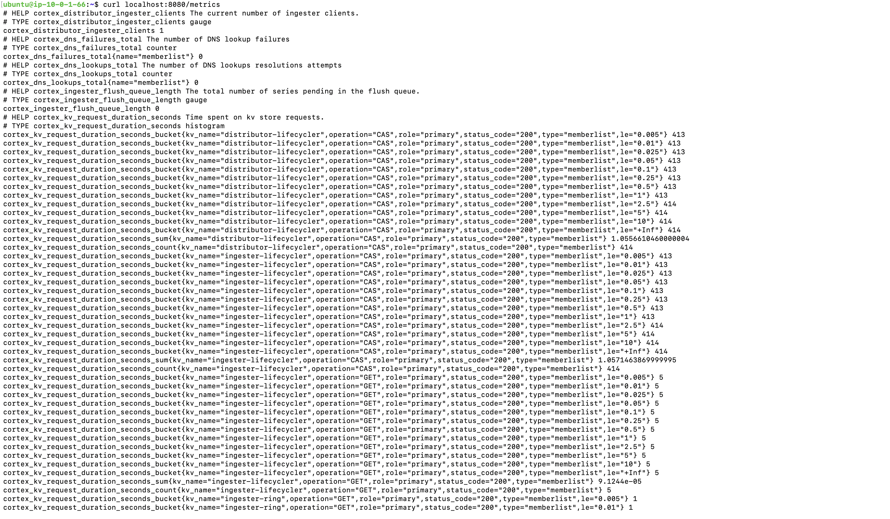

## Prometheus metrics
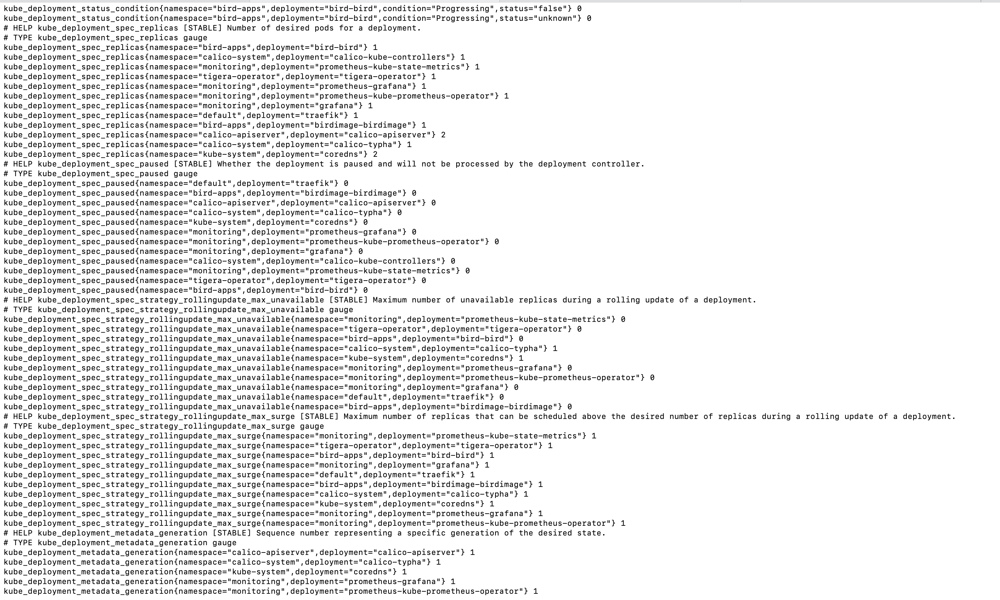


# Bird App Deployment on Private Kubernetes Nodes - Best Practices

## 1. Restrict Node Access
- Use private subnets for master and worker nodes and restrict access via security groups and network ACLs.
- Only allow SSH access to nodes via a bastion host with tightly controlled access (e.g., SSH keys, IP whitelisting).
- Ensure port 22 (SSH) is restricted to your IP or a small set of authorized IP addresses.

## 2. Network Security
- Encrypt all traffic between services using TLS or mTLS for internal communication within the Kubernetes cluster.

## 3. Service Exposure via Ingress
- Keep external services behind an ALB (Application Load Balancer) or private ingress when possible to reduce exposure to the public internet.

## 4. Container and Pod Security
- Use minimal base Docker images for your APIs (e.g., `scratch` or `alpine`) to reduce the attack surface.
- Avoid running containers as root by setting `securityContext.runAsNonRoot` and `securityContext.capabilities` to limit privileges.

## 5. Secrets Management
- Store sensitive information in Kubernetes Secrets or a secure external secrets management service 
- Use role-based access control (RBAC) to restrict access to secrets (IAM)

## 6. Inter-Service Communication
- Use internal Kubernetes DNS for communication between microservices. Ensure all inter-service communication is restricted to internal DNS addresses to avoid exposure to external networks.

## 7. Scaling and Load Balancing
- Implement Horizontal Pod Autoscaling (HPA) for both the `bird-api` and `birdimage-api` to automatically scale based on resource usage.
- Use Auto Scaling Group to adjust the number of worker nodes dynamically as workloads increase or decrease.

## 8. Monitoring and Observability
- Set up Prometheus and Grafana for real-time metrics and alerting. Ensure that critical metrics, such as CPU, memory, network traffic, and API latencies, are monitored.


## 11. CI/CD Pipeline Security
- In your GitHub Actions , use least-privilege access for pushing Docker images and deploying to Kubernetes.
- Ensure secrets used in the pipeline are encrypted and never hard-coded in the repository.
- Regularly update pipeline dependencies and Docker base images to reduce security risks.

## 12. Helm Chart Best Practices
- Template sensitive values in `values.yaml` (e.g., passwords, keys) using Kubernetes Secrets.
- Use versioned Helm charts and follow semantic versioning for reliable deployments.


## Challenge

### How to:

1. Fork the repository.
2. Work on the challenges.
3. Share your repository link with the recruitment team.

### Challenges:

- Install and run the app.
- Dockerize it (create Dockerfile for each API).
- Create infrastructure on AWS (VPC, SG, instances) using IaC.
- Install a small version of Kubernetes on the instances (no EKS).
- Build the manifests to run the 2 APIs on Kubernetes.
- **Bonus Points**: Observability, Helm, Scaling.

### Rules:

- Use security, container, Kubernetes, and cloud best practices.
- Changes in the source code are allowed.

### Evaluation Criteria:

- Best practices.
- Code organization.
- Clarity and readability.
- Task Completed

---

